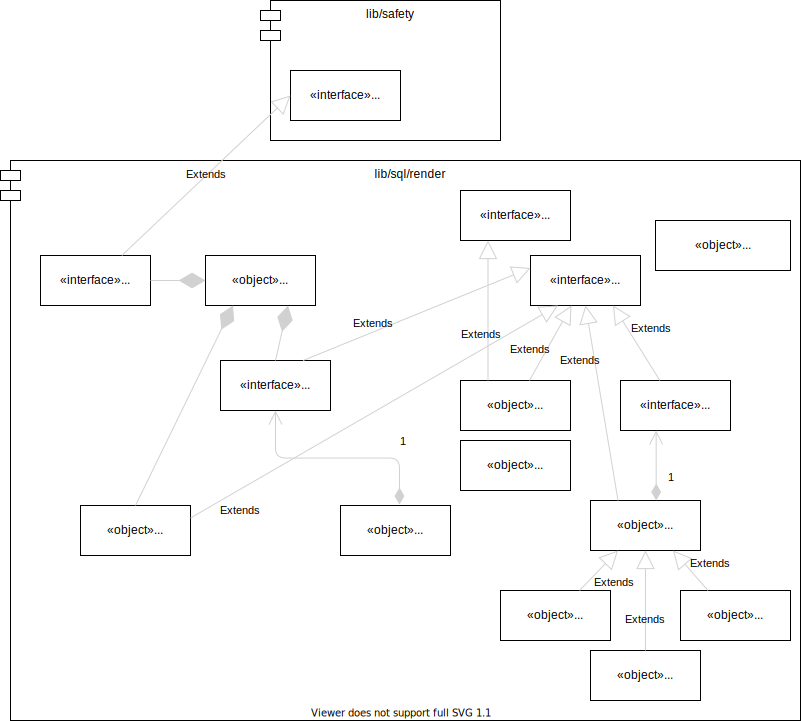

For any modules that leverage SQL for functionality, assembling and loading SQL
in a deterministically reproducible manner is crucial.

`SQLa` is an _aide_ which helps prepare, organize, assemble, load, and revision
manage type-safe, _deterministically reproducible_, SQL code. SQL Aide (`SQLa`)
is SQL rendering/assembler library is a Deno TypeScript module which uses the
power of JavaScript functions and
[Template literals (Template strings)](https://developer.mozilla.org/en-US/docs/Web/JavaScript/Reference/Template_literals)
to prepare SQL components as composable building blocks ("SQL partials").

Instead of inventing yet another template language, `SQLa` uses a set of naming
conventions plus the full power of JavaScript (and TypeScript) template strings
to prepare the final SQL that will be assembled and loaded into the database.

`SQLa` is not an ORM or another layer in the middle between the application and
an RDBMS. Instead, `SQLa` is merely a convenient SQL _generator_ and assembler.
It makes the preparation of SQL DDL, DML, and DQL easier for developers but it
does not rewrite SQL or attempt to remove SQL knowledge.

## SQL rendering module organization

This SQL Aide (`SQLa`) library provides type-safe code generation for the
following types of SQL language constructs.

[Status symbols](https://xit.jotaen.net/):

- [x] Ready for use
- [@] Partially complete
- [ ] Planned, not started yet
- [~] Not planned but could be convinced to add

### DDL (Data Definition Language)

- [x] CREATE: This command is used to create the database or its objects (like
      table, index, function, views, store procedure, and triggers).
- [x] DROP: This command is used to delete objects from the database.
- [ ] ALTER: This is used to alter the structure of the database.
- [ ] TRUNCATE: This is used to remove all records from a table, including all
      spaces allocated for the records are removed.
- [ ] COMMENT: This is used to add comments to the data dictionary.
- RENAME: This is used to rename an object existing in the database.

### DQL (Data Query Language)

- [@] SELECT: It is used to retrieve data from the database.

### DML(Data Manipulation Language)

- [x] INSERT : It is used to insert data into a table.
- [ ] UPDATE: It is used to update existing data within a table.
- [ ] DELETE : It is used to delete records from a database table.
- [ ] CALL: Call a PL/SQL or JAVA subprogram.
- [ ] EXPLAIN PLAN: It describes the access path to data.
- [~] LOCK: Table control concurrency.

### PL (Procedural or Programming Language)

- [x] BODY defines PL (stored function or stored procedure) body
- [x] CONTRACT defines the header, parameter, etcs.

### DCL (Data Control Language)

- [ ] GRANT: This command gives users access privileges to the database.
- [ ] REVOKE: This command withdraws the user’s access privileges given by using
      the GRANT command.

### TCL (Transaction Control Language)

- COMMIT: Commits a Transaction.
- ROLLBACK: Rollbacks a transaction in case of any error occurs.
- SAVEPOINT: Sets a savepoint within a transaction.
- SET TRANSACTION: Specify characteristics for the transaction.

## Architecture

## TODO

- Create CALL SqlTextSupplier as a new stored routine object property similar to
  how a InsertStatementPreparer works. Just like DML is tied to a table, CALL
  should be tied to stored routine header(s) so that there's full type- safety
  integrated into the call.
- In PostgreSQL dialect:
  - array types (e.g. `xyz text[]`) as domains and Axiom(s)
  - in language definition add STABLE and other type-safe modifiers
- Add symmetric and asymmetric encryption domains for storing passwords, IDs,
  etc.
  - See https://github.com/FiloSottile/age et. al but use built-in database
    capabilities through SQL whenever possible
- Add type-safe where criteria builder in DQL SELECT statements so that outbound
  select columns are properly typed but so are in-bound where criteria with
  proper bind-able parameters (using ? or :name strategies).
  - Most of the value should not be derived for generating static SQL
    expressions (which should be written out whenever possible) but using
    Sparx-like QueryDefn dynamic generator for end-user selections
    https://github.com/netspective/NEFS/tree/master/Axiom/src/java/main/com/netspective/axiom/sql/dynamic
    https://github.com/l3aro/pipeline-query-collection
  - We should create a new `where` (or `SQL Expressions`) specific string
    templates literal that can accept experssions like `${a.xyz}` or `${wc.abc}`
    or `${from.name}`.
    - `a` is "SQL statement argument" (similar to stored routines arguments)
      that would automatically emit properly quoted arguments.
    - `wc.*` would be where criteria or similar string builder expressions that
      are in common use like `${wc.in()}` -- be careful to only introduce `wc`
      convenience for type-safety and not make people learn yet another language
    - `from.*` would work by matching `name` with any`TableDefinition` or
      `ViewDefinition` instances in the current scope.
    - `sp.*` and `sf.*` or `sr.*` would point to known stored routines and
      allowing calling them like `${sp.abc(p1, p2, p3)}` which could translate
      to `CALL abc('p1value', p2Value, 'p3value')` etc.
      - each stored routine (stored function/procedure) should have a
        SqlTextSupplier that would generate a `CALL abc(...)` in a type-safe
        manner and not require duplication of SQL. Something like this:
        `${schema.srDefn.call(x, y, z)}`
  - Only introduce high-value type-safety features into template expressions
    which would enhance readability or improve the SQL, not try to replace it or
    create another DSL. `SQLa` is about SQL assembly, not replacing SQL.
- Implement dml/dto.ts for type-safe Axiom-based data transfer objects to/from
  camel-case JS objects and snake_case SQL-style records
- Incorporate
  [Database Performance for Developers](https://use-the-index-luke.com/)
  suggestions into SQLa renderers so that developers just have to give feature
  flags and the proper SQL is generated for them.
- Incorporate
  [Evolutionary Database Design](https://martinfowler.com/articles/evodb.html)
  principles into SQL rendering infrastructure.
- See if
  [Database Change and Version Control for Teams](https://www.bytebase.com/_nuxt/img/main.a176dc4.webp)
  makes sense as a generator target.
- Learn from [DataHub](https://datahubproject.io/docs/features) about how to
  document and manage meta data ('data governance') artifacts and incorporate
  appropriate governance capabilities. These are DataHub features we should
  understand and perhaps push into DataHub:
  - Tracing lineage across platforms, datasets, pipelines, charts, etc.
  - Context about related entities across lineage
  - Capture and maintain institutional knowledge using folksonomic identifiers
    (tags) and taxonomies
  - Asset ownership by users and/or user groups
  - Fine-Grained Access Control with Policies
  - Metadata quality & usage analytics
- Integrate strategies from the following into the code generated by RF:
  - [Lesser Known PostgreSQL Features](https://hakibenita.com/postgresql-unknown-features)
  - [GitLab Migration Style Guide](https://docs.gitlab.com/ee/development/migration_style_guide.html)
  - [Common DB schema change mistakes](https://postgres.ai/blog/20220525-common-db-schema-change-mistakes#case-1-schema-mismatch)
